## Launch the Navigation Stack via GUI (step-by-step)

### [0] Prepare the Environment

For elevation_mapping_cupy, follow the instructions at: https://leggedrobotics.github.io/elevation_mapping_cupy/getting_started/installation.html.

Several planning and perception nodes are started through Python wrapper scripts. Before using the GUI, create a Python environment and install the required packages:


```bash
conda create -n mars_nav python=3.8 -y
conda activate mars_nav
pip install -r requirements.txt
```

Then edit [tools/python_env.sh](tools/python_env.sh) and set `PYTHON_BIN` to the interpreter inside your environment, for example:

```bash
PYTHON_BIN="$HOME/miniconda3/envs/mars_nav/bin/python"
```

If you prefer not to edit the file, you can export `PYTHON_BIN` before starting RQt.

### [1] Run Simulation

This project uses the Gazebo simulation from the European Rover Challenge for demonstration. Reference: https://docs.fictionlab.pl/integrations/noetic/software/gazebo-simulation

#### Launch the simulation environment

```bash
roslaunch leo_erc_gazebo leo_marsyard.launch
```

#### Open RViz

```bash
roslaunch leo_erc_viz rviz.launch
```

#### Optional: Keyboard teleoperation

```bash
rosrun leo_erc_teleop key_teleop
```

### [2] Test the Perception Modules

Note: Before running perception tests, set `mode_activate` to `false` in the relevant config files:

- `hazard_detection`: `config/config.yaml` and `config/fuse_map.yaml` → `mode_activate`
- `elevation_mapping_cupy`: `config/leo/core_params` → `mode_activate`

#### 2D Hazard Mapping

```bash
roslaunch hazard_detection mapping_leo.launch
```

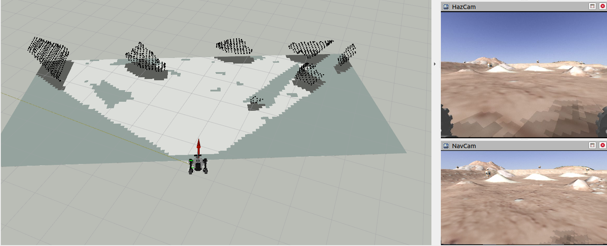

#### 2.5D Mapping and Traversability

```bash
roslaunch elevation_mapping_cupy rviz.launch
```

<table>
	<tr>
		<td>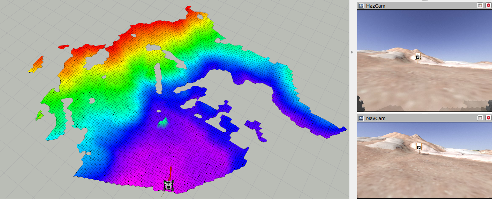</td>
		<td>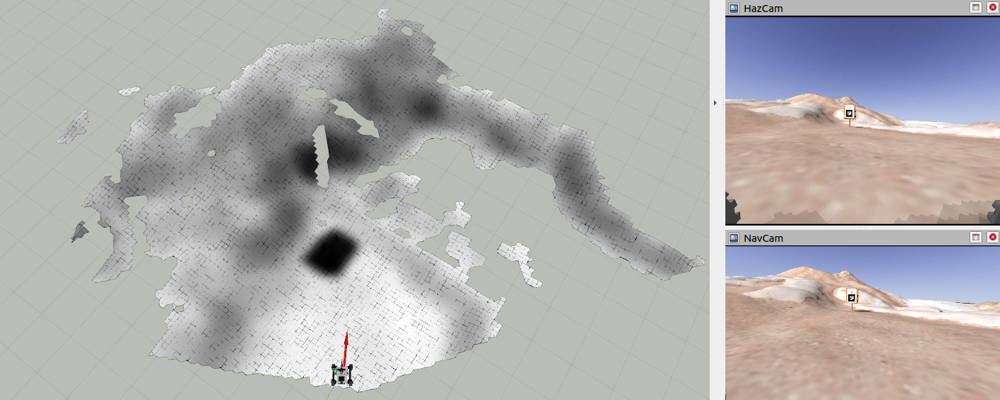</td>
	</tr>
	<tr>
		<td align="center">Rough elevation map</td>
		<td align="center">Rough traversability map</td>
	</tr>
</table>

### [3] Start the nodes step by step
#### 1. Initialize the Navigation GUI Plugin

Start Rqt and open the Navigation GUI widget from the Plugins menu:

```bash
rqt
```


#### 2. Initialize the Global Map
Generate the global map from a heightmap.

**Step 1:** Activate the map server using the GUI:

<table>
	<tr>
		<td>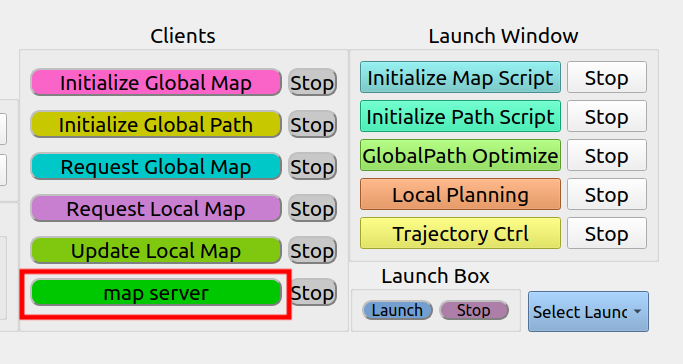</td>
		<td>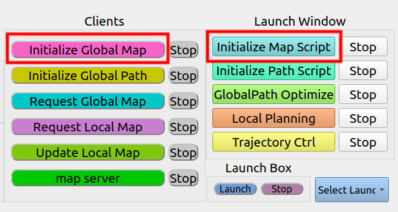</td>
	</tr>
	<tr>
		<td align="center">Activate map server</td>
		<td align="center">Start global map client</td>
	</tr>
</table>

The generated global map will be displayed in RViz:

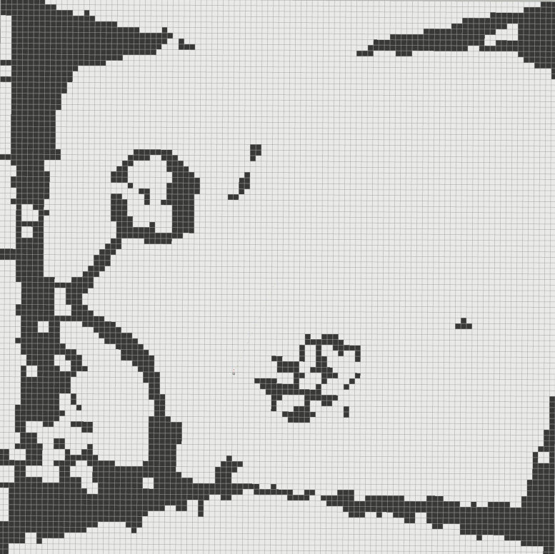

#### 3. Initialize the Global Path
Create a global path based on the global map.

**Step 1:** Start the global path client and initialization script:

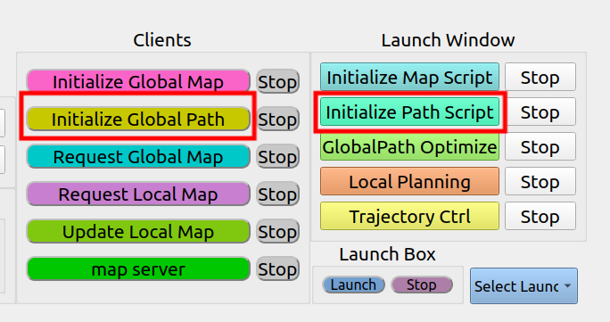

**Step 2:** In RViz, use the **2D Nav Goal** tool to set a global goal. The system will compute and publish the global path:

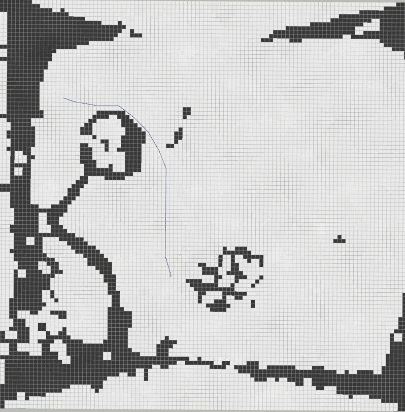

##### Alternative: Publish a custom path
You can manually publish a path to the `/global_planner/global_path` topic to initialize the planner with a custom trajectory.

#### 4. Launch the Navigation Stack: Mapping, Planning, and Control

Note: Before launching the full navigation stack, set `mode_activate` to `true` in the perception config files so mapping runs as intended:

- `hazard_detection`: `config/config.yaml` and `config/fuse_map.yaml` → `mode_activate`
- `elevation_mapping_cupy`: `config/leo/core_params` → `mode_activate`

##### Local Mapping
Start the 2D and 2.5D local mapping modules from the GUI:

<table>
	<tr>
		<td>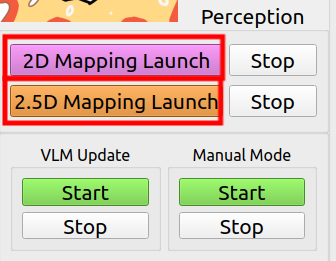</td>
		<td>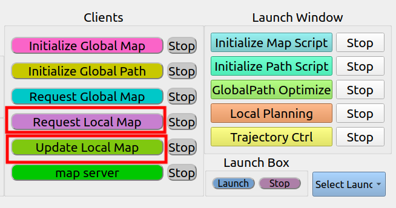</td>
	</tr>
	<tr>
		<td align="center">Local mapping</td>
		<td align="center">Local map client / update</td>
	</tr>
</table>

##### Local Planning
Start global path optimization and the local planner:

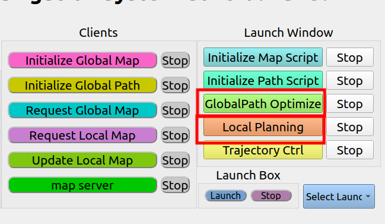

##### Local Path Following
Start the pure pursuit path follower:

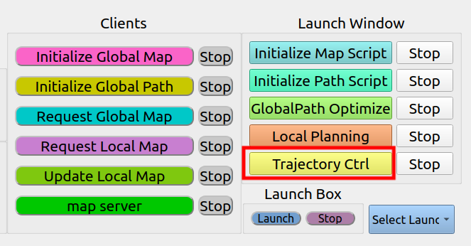

#### 5. Launch the Mode Activator
You may begin with the manual mode activator to learn how mode switching works.


When the manual activator is running it will print the following and wait for user input:

```
Mode Handler Initialized
Enter mode: 1 for efficient, 2 for safe, 3 for conservative:
```

Type the mode number and press Enter; the node will publish the chosen mode on `/navigation_mode`.

The VLM mode activator subscribes to RGB and depth topics, calls the external VLM API, and publishes the predicted navigation mode on `/navigation_mode`. An API Key is required to set up the script.