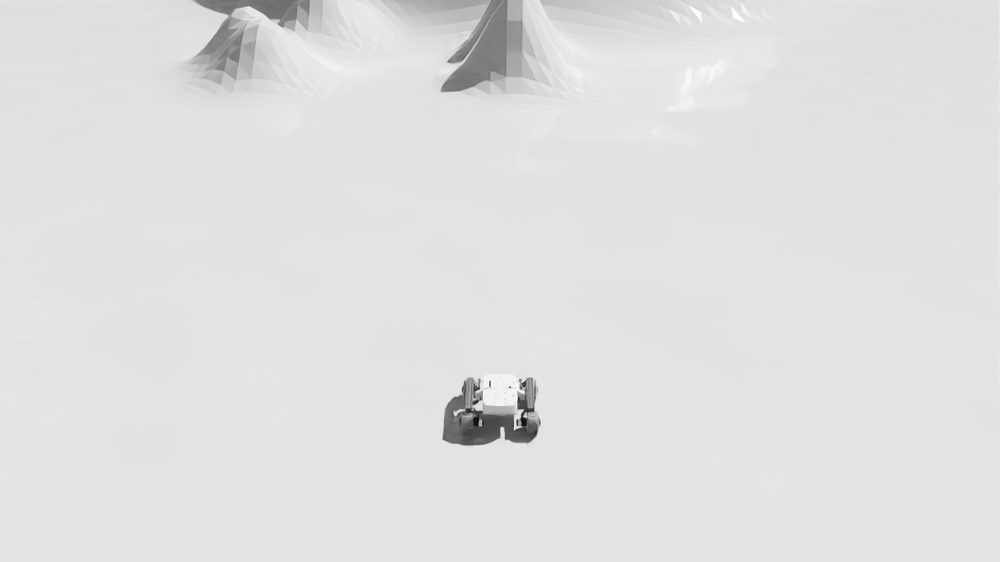
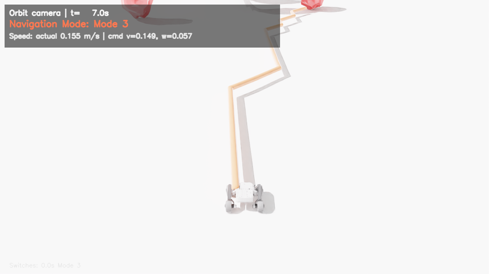
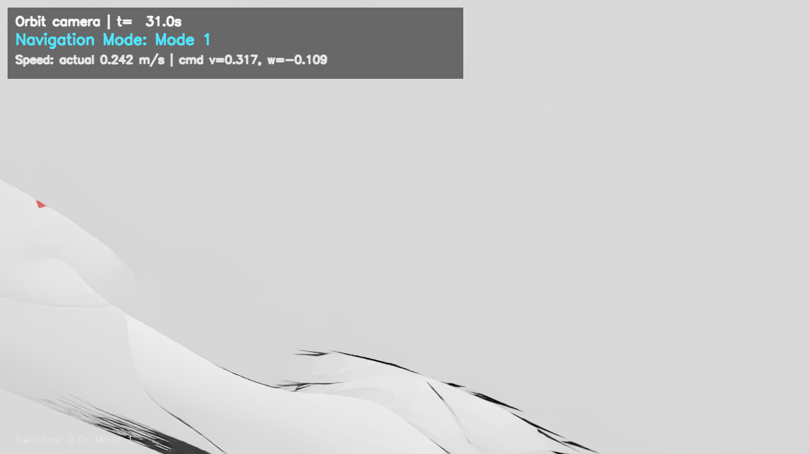
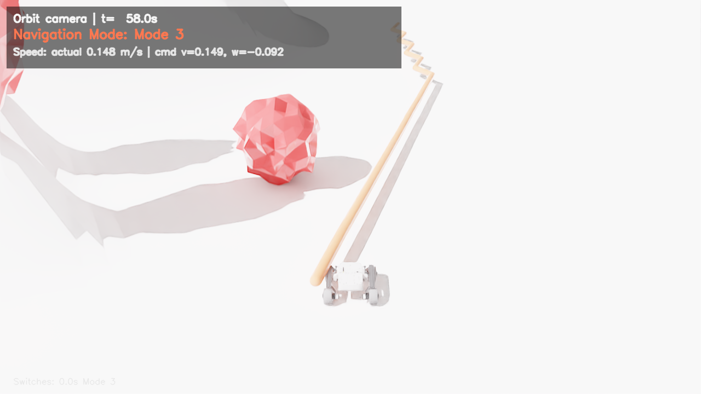
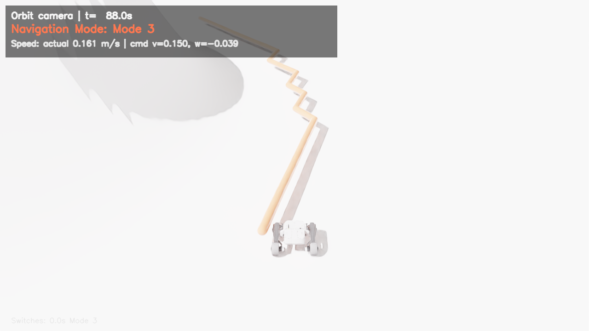
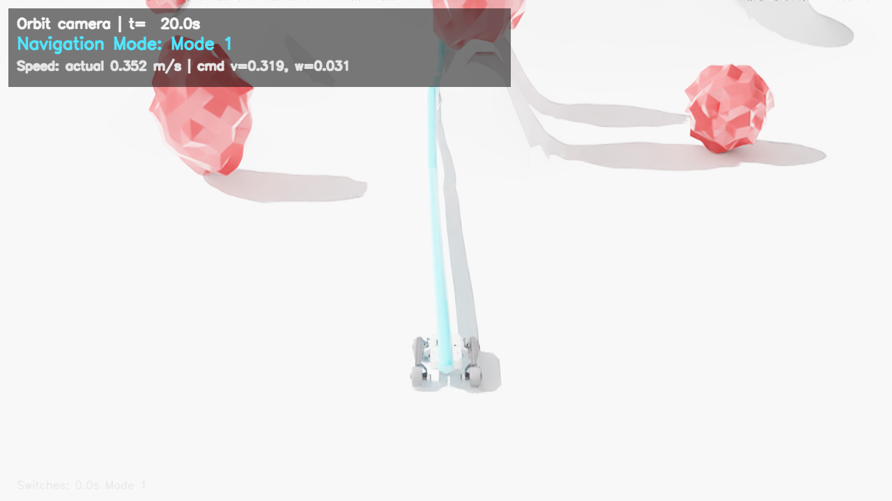
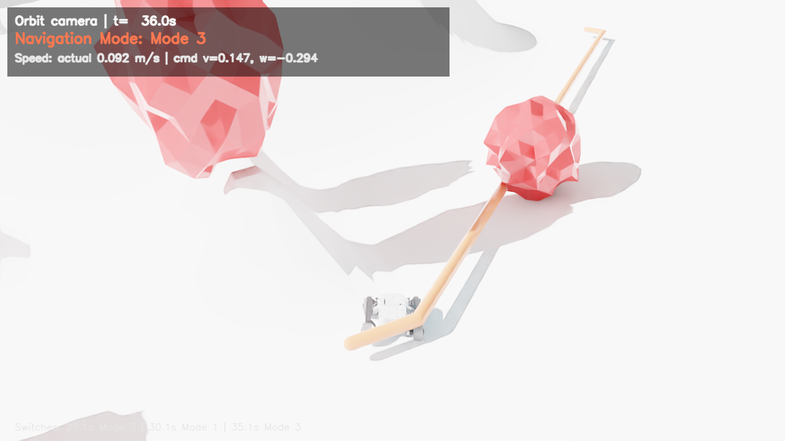
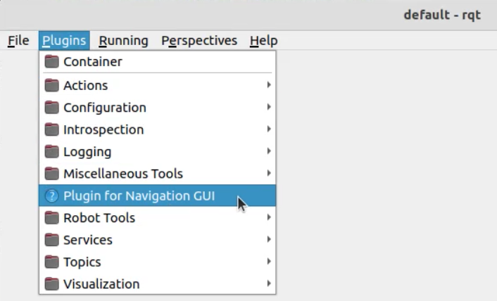
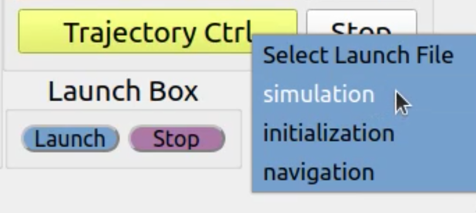
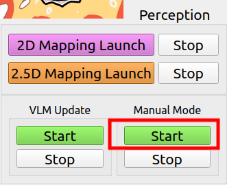

## Mars Navigation Framework

This repository contains the open-source implementation for the paper "VLM-empowered Multi-Mode System for Efficient and Safe Planetary Navigation" (IROS 2025). Further details and project materials are available at: https://chengsn1234.github.io/multi-mode-planetary-navigation/.

### Fork Update: Isaac Sim Lunar Closed Loop

This fork adds a second, newer reproduction path based on **Ubuntu 22.04 + ROS 2 Humble + Isaac Sim 5.1.0**.  The original upstream stack remains a **ROS 1 Noetic + Gazebo** implementation, while the new `ros2/` and `isaac/` folders run the same multi-mode navigation logic against an Isaac Sim lunar scene with real rigid-body dynamics, rendered camera frames, lunar gravity, collision rocks, VLM mode switching, and video recording.



Rendered Isaac Sim scenes (OmniLRS lunar material, sun lighting, ray-traced
rendering; rover, lunar surface, crater, collision rocks, sunlight shadows):

| | | |
|---|---|---|
|  |  |  |
| Rover + lunar surface + regolith material | Collision boulder + sunlight shadow | Boulders on the lunar surface |
|  |  |  |
| Crater rim + bowl | In-scene navigation guide line | HUD: mode / speed / VLM Q&A / mode switches |

The Isaac Sim version is the recommended path for this fork on Ubuntu 22.04:

```bash
cd /home/lry/mars_navigation/ros2
bash mars_navigation_ros2/scripts/run_isaac_experiments.sh vlm
```

Key Isaac Sim additions:

- `isaac/isaac_lunar_loop.py`: Isaac process with lunar terrain mesh, Leo rover URDF, Moon gravity, ROS 2 bridge, rendered camera publishing, collision rocks, path-line visualization, speed/VLM/mode HUD overlays, and video frame recording.
- `ros2/mars_navigation_ros2/`: ROS 2 Humble port of the planner, mode selector, map server, path follower, and evaluator.
- `/vlm/qa`: VLM question/answer telemetry published by `vlm_mode.py` and overlaid into the recorded Isaac videos.
- `docs/isaacsim_omnilrs_integration.md`: details for OmniLRS lunar material, sun lighting, rendering settings, physics settings, collision rocks, and video generation.

The historical Gazebo/ROS 1 path below is kept for upstream compatibility and for users on Ubuntu 20.04.

### Dependencies

ROS packages should be installed through your ROS Noetic workspace as usual.

For elevation_mapping_cupy, follow the instructions at: https://leggedrobotics.github.io/elevation_mapping_cupy/getting_started/installation.html.

```bash
conda create -n mars_nav python=3.8 -y
conda activate mars_nav
pip install -r requirements.txt
```

After the environment is created, point [tools/python_env.sh](tools/python_env.sh) to your interpreter path, for example:

```bash
PYTHON_BIN="$HOME/miniconda3/envs/mars_nav/bin/python"
```

You may also export `PYTHON_BIN` before launching the stack.

### Build the Workspace

Clone the repository to your workspace, and run:
```bash
catkin build globalmap_server
catkin build elevation_mapping_cupy -DCMAKE_BUILD_TYPE=Release
catkin build -DCMAKE_BUILD_TYPE=Release
```
Source the workspace or add it to `.bashrc`:
```bash
source devel/setup.bash
```

For a paper-oriented reproduction checklist, including the module-to-paper
mapping, launch order, verification topics, and metric collection notes, see
[REPRODUCTION.md](REPRODUCTION.md).

### Quickstart via GUI
To start the navigation stack interactively, use the provided RQt plugin. We provide a shortcut for quickstart. For step-by-step instructions see [launch_from_gui.md](launch_from_gui.md).
Start Rqt and open the Navigation GUI widget from the Plugins menu:

```bash
rqt
```

Before launching any GUI action that starts a Python node, make sure the Python environment above is installed and [tools/python_env.sh](tools/python_env.sh) points to the correct interpreter.

<table>
	<tr>
		<td></td>
		<td></td>
	</tr>
	<tr>
		<td align="center">Navigation GUI</td>
		<td align="center">Launch controls (Simulation / Initialization / Navigation)</td>
	</tr>
</table>

#### Step 1: Simulation

The Simulation action launch the simulation environment (Gazebo) and RViz visualization.

#### Step 2: Initialization
Initialization prepares the map server and required clients, and generates the initial global map and path.

Start the Initialization action in the GUI and wait until the global map appears in RViz. Use the "2D Nav Goal" tool in RViz to set a global goal; the planned global path (blue) should appear.

#### Step 3: Navigation

The Navigation action launches the mapping, planning, and control modules for the three operating modes. Note: mode switching is not performed automatically by this action.

The command-line equivalents used by the GUI are:

```bash
roslaunch hazard_detection detect_and_mapping.launch
roslaunch elevation_mapping_cupy mapping_leo.launch
roslaunch globalmap_server getlocalmap_client.launch
roslaunch globalmap_server updatemap_client.launch
./planning/global_path_optimizer/scripts/global_path_optimize.sh
./planning/local_planner/scripts/local_planner.sh
roslaunch c_pursuit_ctrl c_pursuit.launch
```

#### Step 4: Mode Switching
You can switch modes manually for testing, or enable the VLM-based mode activator.



When the manual activator runs, the node prints the following and awaits input:

```
Mode Handler Initialized
Enter mode: 1 for efficient, 2 for safe, 3 for conservative:
```

Enter the desired mode number and press Enter; the node will publish the chosen mode on the `/navigation_mode` topic.

The VLM mode activator subscribes to RGB and depth topics, calls the VLM API, and publishes the predicted navigation mode on `/navigation_mode`. Enable the VLM activator by using `VLM Update`. You need an API Key to set up the script.

By default, the VLM activator now targets the local OmniLRS Qwen3-VL vLLM
endpoint instead of an external multimodal API:

```bash
QWEN_VL_BASE_URL=http://127.0.0.1:22002/v1 \
QWEN_VL_MODEL=/home/lry/OmniLRS/deploy/qwen3vl/models/Qwen3-VL-8B-Instruct-AWQ-4bit \
./perception/terrain_classification/scripts/VLM_depth_launch.sh
```

Before using it, start the local model service:

```bash
bash /home/lry/OmniLRS/deploy/qwen3vl/scripts/start_vllm_background.sh
```

For a no-ROS smoke test, run:

```bash
/home/lry/OmniLRS/deploy/qwen3vl/.venv/bin/python tools/test_local_qwen_vlm.py docs/picture/perception/rough_env.png
```

### NOTE
This system was ported from MarsSim, another simulation platform. Some parameters still require tuning (e.g. elevation and planner cost parameters), which may lead to unexpected behaviour in some scenarios. We apologize for the inconvenience.

### Acknowledgements
This project builds on ideas and code from the following works:

- Miki T., Wellhausen L., Grandia R., et al. "Elevation mapping for locomotion and navigation using GPU." IROS 2022.
- Azkarate M., Gerdes L., Joudrier L., et al. "A GNC architecture for planetary rovers with autonomous navigation." ICRA 2020.
- Zhou R., Feng W., Ding L., et al. "MarsSim: A high-fidelity physical and visual simulation for Mars rovers." IEEE Trans. on Aerospace and Electronic Systems, 2022.

We also used AI-assisted tools (e.g., ChatGPT, Claude, Grok, Qwen) during development for assistance.


